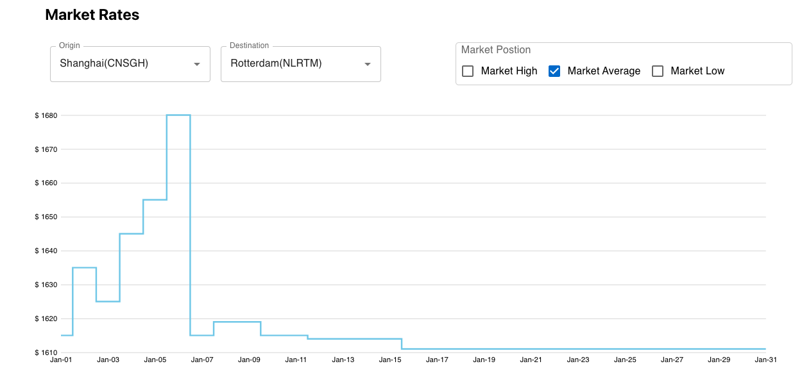
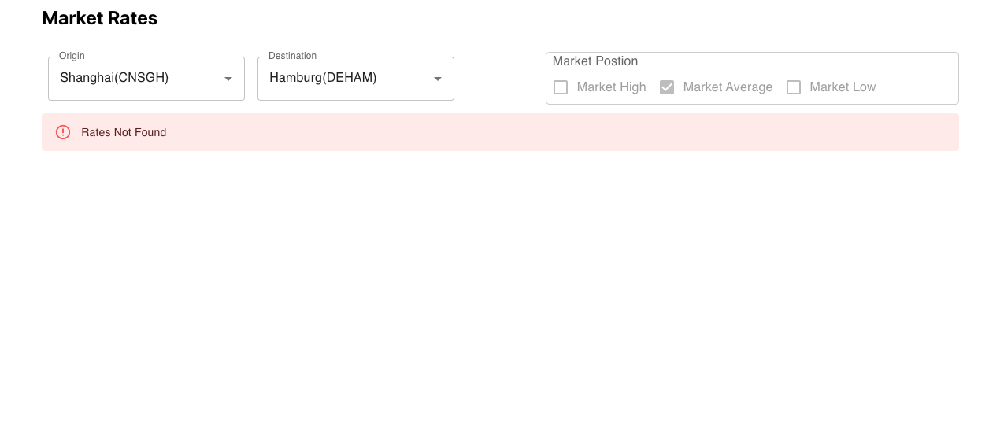
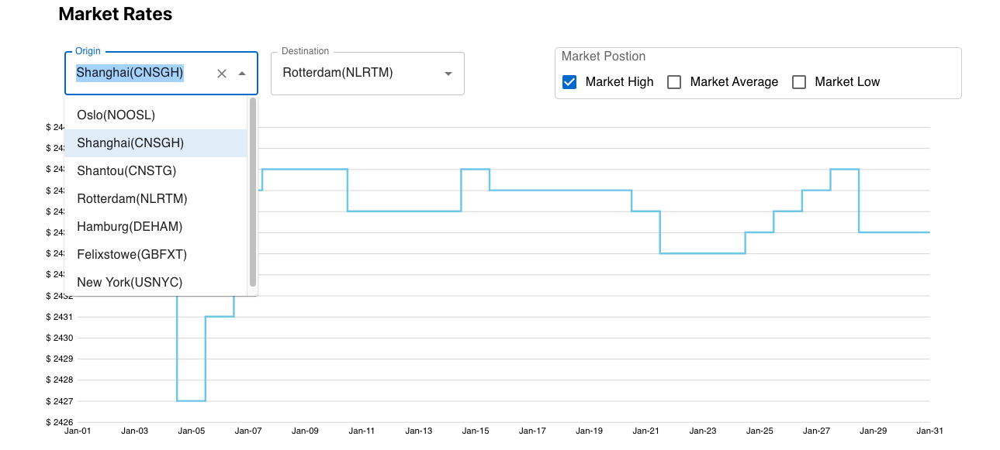
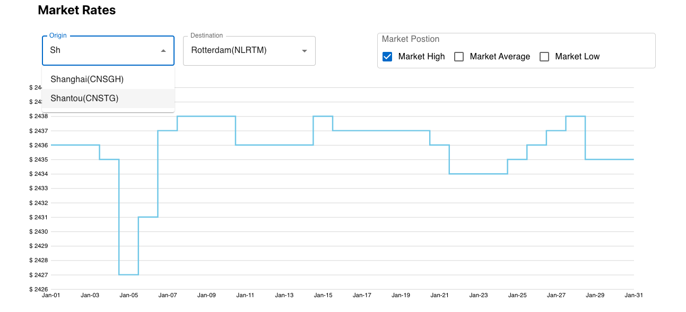

# Getting Started

This project was bootstrapped with [Create React App](https://github.com/facebook/create-react-app).
## System Requirements
You’ll need to have Node >= 14.0.0 and npm >= 5.6 on your machine.\
[Install Node Js](https://nodejs.org/)

You need to install and run with yarn since this project uses Material UI with styled components.
[Install Yarn](https://classic.yarnpkg.com/lang/en/docs/install/)

## Getting Started
1. Open the terminal(Windows Command Prompt or PowerShell)
2. Navigate to the project folder.
3. Rename /src/sample-config.js to /src/config.js and replace the text `<api-key>` with your api key.
4. Install yarn 
### `npm install --global yarn`
5. Run the following command to install the required dependencies.
###  `yarn`
6. Run the following command.
### `yarn start`
Runs the app in the development mode.\
Open [http://localhost:3000](http://localhost:3000) to view it in the browser.

The page will reload if you make edits.\
You will also see any lint errors in the console.
7. Running tests.
### `yarn test`

aunches the test runner in the interactive watch mode.\
See the section about [running tests](https://facebook.github.io/create-react-app/docs/running-tests) for more information.
### `yarn cypress`

Lauches cypress UI and you can run the integration tests.

8. Production deployment
### `yarn build`

Builds the app for production to the `build` folder.\
It correctly bundles React in production mode and optimizes the build for the best performance.

The build is minified and the filenames include the hashes.\
Your app is ready to be deployed!

## UI Screens

### Dashboard View

### Error View

### Dropdown View

### Search View

